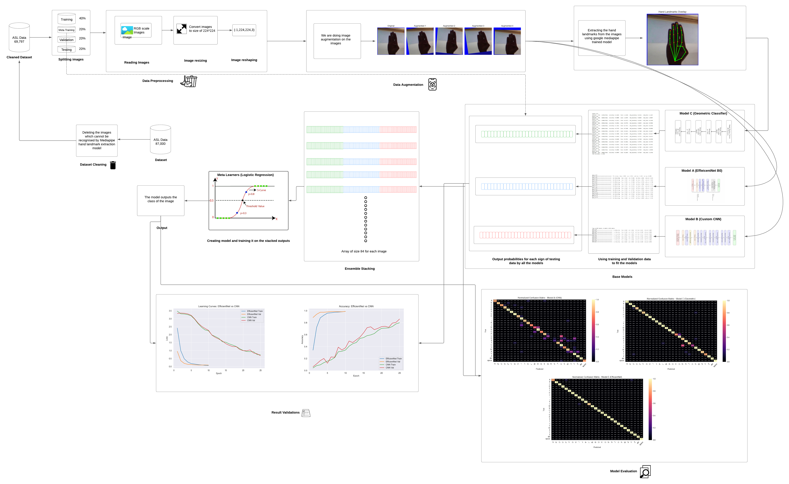
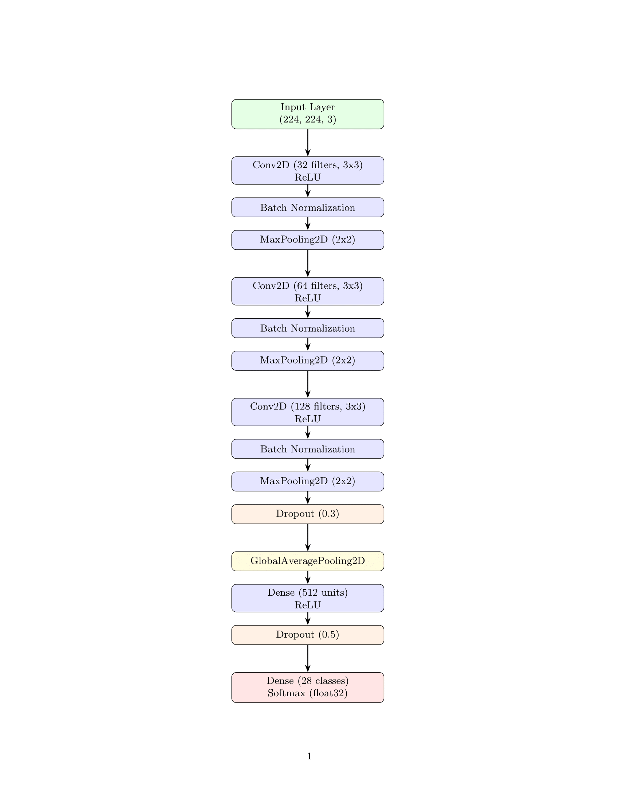
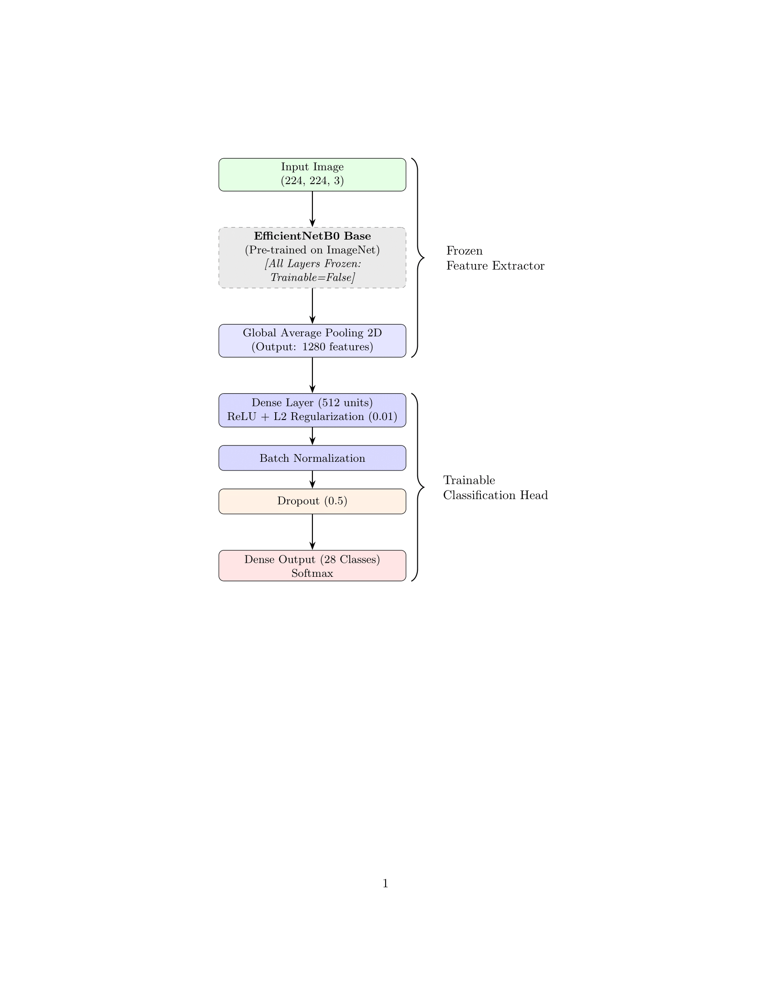

# ASL Alphabet Recognition - WS25-PR9

## Group Member
- **Ashwin Shahaji Walunj**

## Project Overview
This project implements a deep learning pipeline to recognize American Sign Language (ASL) from a dataset of 69,797 images across 28 classes. We utilize a custom CNN (Model B), Geometric Classifier(Model C), and a pretrained model EfficientNetB0(Model E). Then we stacked the output of each model and provided it as training data to the meta-learner to achieve high accuracy.

## Data Source
The data source for this project is Kaggle ASL alphabet dataset(https://www.kaggle.com/datasets/grassknoted/asl-alphabet) containing 87,000 images. We did preprocessing on the dataset to remove the images which would not be detected by Google's mediapipe hand landmark extraction model *[hand_landmarker.task](hand_landmarker.task)* which reduced the number to 69,797.

## Workflow


## Model Architecture
**Model B (Custom CNN)**



**Model E (EfficientNetB0)**



**Model C (Geometric Classifier)**


## Requirements
- TensorFlow 2.15+
- OpenCV
- Matplotlib
- Scikit-learn
- Mediapipe

## Reproduction Instructions
To reproduce the results in the *[pr-asl.ipynb](pr-asl.ipynb)* notebook:
1. **Dataset:** Download the processed data from *[dataset](dataset)*.
2. **Requirements:** Execute the file *[requirements.sh](requirements.sh)* to install all the required dependencies. Use the following command ```sh requirements.sh ``` to execute the file.
3. **Execution:** Open the notebook on your desired editor or platform and upload the dataset. Execute the script and you should have all the outputs presented.

