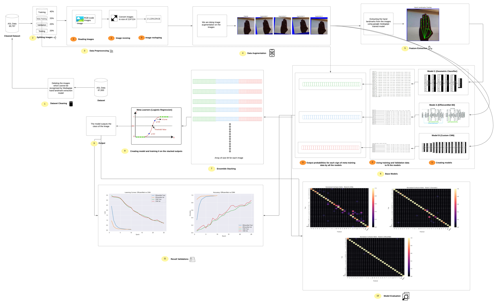

# 📑 ASL Alphabet Recognition: Stacking Ensemble Approach
**Group Number:** WS25-PR9

## 👤 Group Member
* **Ashwin Shahaji Walunj** (Technical Lead, Designer, & Storyteller)

---

## 🎯 Project Overview
This project implements a robust deep learning pipeline to recognize **American Sign Language (ASL)**. By leveraging an ensemble of spatial, geometric, and transfer-learning features, we utilize a **Meta-Learner** to aggregate predictions from three base models, achieving superior generalization across 28 ASL classes.

---

## 📊 Dataset & Preprocessing
* **Source:** [Kaggle ASL Alphabet Dataset](https://www.kaggle.com/datasets/grassknoted/asl-alphabet) (Original: 87,000 images).
* **Refinement:** We filtered the dataset using **Google MediaPipe** to ensure landmark consistency. 
* **Final Count:** **69,797 high-quality images** (post-detection filtering).
* **Landmark Task:** Utilized `hand_landmarker.task` for 21-point geometric extraction.

---

## 🛠 Technical Workflow
The system follows a modular pipeline from raw image ingestion to ensemble prediction:




---

## 🏗 Model Architectures
We utilize a **Stacking Strategy** where the outputs of the following base models serve as inputs for the final Meta-Learner:

| Model | Type | Focus |
| :--- | :--- | :--- |
| **Model B** | Custom CNN | Local spatial hand-shape features |
| **Model E** | EfficientNetB0 | Pre-trained global feature extraction |
| **Model C** | Geometric Classifier | 21-point hand landmark coordinates |

### 🔍 Architecture Details
<details>
<summary>Click to view Base Model Diagrams</summary>

#### Model B: Custom CNN


#### Model E: EfficientNetB0 (Transfer Learning)


#### Model C: Geometric Classifier

</details>

---

## 💻 Reproduction Instructions
Follow these steps to replicate the experimental results in *[ws25-pr9.ipynb](ws25-pr9.ipynb)*:

### 1. Environment Setup
Ensure you have a Linux/Mac environment or Git Bash on Windows. Run the shell script to install **TensorFlow 2.15+, MediaPipe, and Scikit-Learn**:
```bash
sh requirements.sh
```

### 2. Dataset
Download the processed data from *[dataset](dataset)*.

### 3.Execution
Open the notebook on your desired editor or platform and upload the dataset. Execute the script and you should have all the outputs presented.

***Note: It might take upto 2 hrs to completely execute the notebook from scratch, as training the models might take time.Performance may vary based on hardware acceleration (CUDA/Metal/TPU)..***